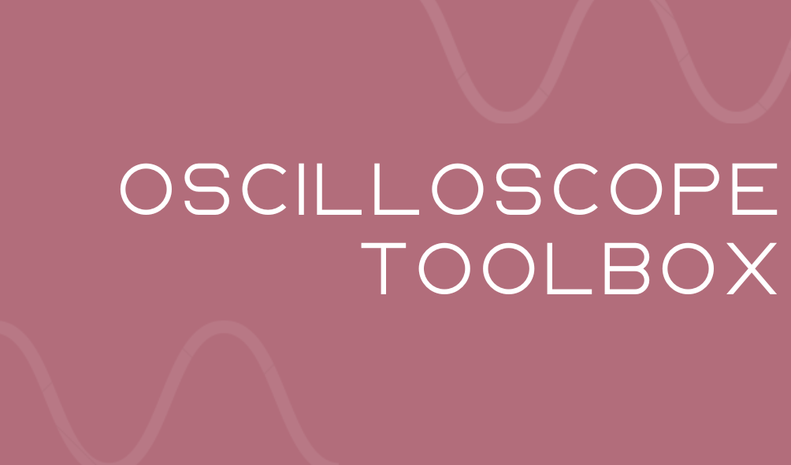

# Overview
The Oscilloscope Toolbox is a toolbox to make interacting with Oscilloscope data easier on matlab. It automatically reads and parses the data files imported from a Tektronix oscilloscopes, with minimal configuration. 

The main use cases are if you need to add the wave forms read into a document/report and want to have control over how it looks (axis, labels, scale, legends, etc) and if you want to later run other signal analysis with the collected data, without the need to re-run the experiments.


# Functionality

## Methods 

## Examples

# Oscilloscope 

## SetUp
First and foremost we need to setup the oscilloscope to save to the flash drive all the data points recorded. To do that we can configure it to flash the data whenever we press the "print" button.

To setup first press the utility button, ... ADD DESCRIPTION LATTER

# MatLab 

##  SetUp
To use the toolbox you can either :

1. Clone the repository: 
    - First you need to clone this repository by typing, on the command line: 
    ```bash
    git clone https://github.com/Pedro4064/Oscilloscope_ToolBox.git
    ```

    - Then we you need to change into the cloned directory and move the `Oscilloscope_Data.m` file to the directory you are working at (where you are writing you live script, or matlab script file).

2. Download the `Oscilloscope_Data.m` file:
    - You can access the [Oscilloscope_Data.m](https://raw.githubusercontent.com/Pedro4064/Oscilloscope_ToolBox/master/Oscilloscope_Data.m) file directly and press Cmd+s (if on Mac) or Ctrl+s (if on Windows/Linux) and save the file with the name `Oscilloscope_Data.m`, making sure to same with the `.m` extension.

    - Another possibility is to use the command line, already in the working directory, by using:
    ```bash
    curl https://raw.githubusercontent.com/Pedro4064/Oscilloscope_ToolBox/master/Oscilloscope_Data.m > Oscilloscope_Data.m
    ```


# To Do